<h1 style="font-size: 2.5rem; font-weight: bold;">物聯網課程</h1>
<h1 style="font-size: 5rem; margin-top: 0px; font-weight: bold;">基礎教學手冊</h1>

---
transition: slide-title
layout: side-title
color: dark
routeAlias: Outline
titlewidth: is-2
---

::title::

<h1 style="font-size: 3rem; font-weight: bold;">目錄</h1>
<h6 style="font-size: 1rem;">※本教材以 Windows 系統為主</h6>

::content::

<h1 style="font-size: 3rem; font-weight: bold;">編譯器安裝</h1>
<h1 style="font-size: 2rem; font-weight: bold;">Visual Studio Code <devicon-vscode/></h1>
<h1 style="font-size: 2rem; font-weight: bold;">├─  <Link to="VSCode_Install">Visual Studio Code 安裝</Link></h1>
<h1 style="font-size: 2rem; font-weight: bold;">├─  <Link to="Singular_Blockly">Singular Blockly</Link></h1>
<h1 style="font-size: 2rem; font-weight: bold;">└─  <Link to="Wokwi_Simulator">Wokwi Simulator</Link></h1>
<h1 style="font-size: 2rem; font-weight: bold;">Arduino IDE <skill-icons-arduino/></h1>
<h1 style="font-size: 2rem; font-weight: bold;">├─  <Link to="Arduino_IDE_Install">Arduino IDE 安裝</Link></h1>
<h1 style="font-size: 2rem; font-weight: bold;">└─  <Link to="Arduino_IDE_Basic_Operation">Arduino IDE 基礎操作</Link></h1> 
<h1 style="font-size: 3rem; font-weight: bold;">實作基礎</h1>
<h1 style="font-size: 2rem; font-weight: bold;">開發板基礎</h1>
<h1 style="font-size: 2rem; font-weight: bold;">├─  <Link to="Board_Wiring_Basics">開發板接線基礎概念</Link></h1>
<h1 style="font-size: 2rem; font-weight: bold;">└─  <Link to="Programming_Basics_(Arduino_Syntax)">開發板程式基礎 (Arduino 語法)</Link></h1>

---
transition: slide-left
layout: top-title
color: dark
routeAlias: VSCode_Install
---

::title::

<h1 style="font-size: 2.5rem; font-weight: bold;">Visual Studio Code 安裝</h1>

::content::

<h2 style="font-size: 2rem; font-weight: bold;">Visual Studio Code 或稱 VS Code，常見的整合開發環境 (IDE，Integrated Development Environment)。</h2>
 

  <h2 style="margin: 0;">Step 1：瀏覽器搜尋「Visual Studio Code」</h2>
  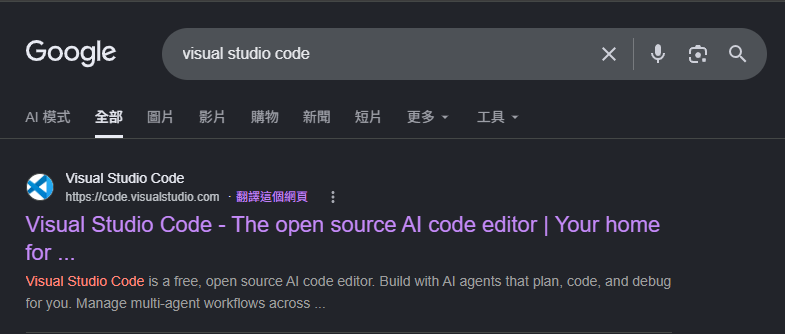

---
transition: slide-left
layout: top-title
color: dark
---

::title::

<h1 style="font-size: 2.5rem; font-weight: bold;">Visual Studio Code 安裝</h1>

::content::

  <h2 style="margin: 0;">Step 2：找到下載 (Download) 選項</h2>
  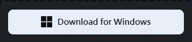

  <h2 style="margin: 0;">Step 3：找到出剛剛下載的檔案</h2>
  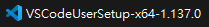

  <h2 style="margin: 0;">Step 4：點擊兩次開啟後進行安裝流程，一律同意</h2>

  <h2 style="margin: 0;">Step 5：安裝完成後開啟檢查</h2>

---
transition: slide-left
layout: top-title
color: dark
---

::title::

<h1 style="font-size: 2.5rem; font-weight: bold;">Visual Studio Code 安裝</h1>

::content::

  <h2 style="margin: 0;">Step 6：如果不是繁體中文介面，首先找到延伸模組選項 (或 Ctrl + Shift + X)</h2>
  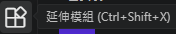

  <h2 style="margin: 0;">Step 7：搜尋「Chinese (Traditional) Language Pack for Visual Studio Code」</h2>
  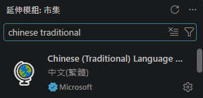

  <h2 style="margin: 0;">Step 8：安裝後重新啟動 Visual Studio Code</h2>

---
transition: slide-left
layout: top-title
color: dark
routeAlias: Singular_Blockly
---

::title::

<h1 style="font-size: 2.5rem; font-weight: bold;">Singular Blockly</h1>

::content::

  <h2 style="margin: 0;">Step 0：開啟 Visual Studio Code (尚未安裝請到<Link to="VSCode_Install">Visual Studio Code 安裝</Link>)</h2>

  <h2 style="margin: 0;">Step 1：於左側找到延伸模組選項 (或 Ctrl + Shift + X)</h2>
  

  <h2 style="margin: 0;">Step 2：搜尋「Singular Blockly」並安裝</h2>
  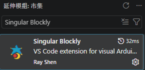

---
transition: slide-left
layout: top-title
color: dark
---

::title::

<h1 style="font-size: 2.5rem; font-weight: bold;">Singular Blockly</h1>

::content::

  <h2 style="margin: 0;">Step 3：安裝後於左側找到 Singular Blockly 圖示</h2>
  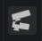

  <h2 style="margin: 0;">Step 3.5：或使用 (Ctrl + Shift + P) 或 F1 開啟命令選擇區 (Command Palette)，搜尋「Singular Blockly」並選擇「顯示 Singular Blockly」</h2>
  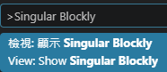

  <h2 style="margin: 0;">Step 4：點選提示的「開啟資料夾」並選擇一個用來放程式的資料夾</h2>
  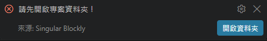

---
transition: slide-left
layout: top-title
color: dark
---

::title::

<h1 style="font-size: 2.5rem; font-weight: bold;">Singular Blockly</h1>

::content::

  <h2 style="margin: 0;">Step 4：點選「好，開始吧！」讓環境自動建立</h2>
  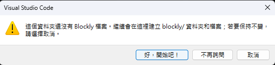

  <h2 style="margin: 0;">Step 5：於右上角選擇要使用的開發板</h2>
  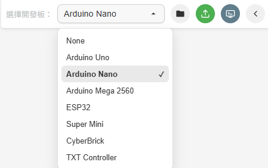

---
transition: slide-left
layout: top-title
color: dark
---

::title::

<h1 style="font-size: 2.5rem; font-weight: bold;">Singular Blockly</h1>

::content::

  <h2 style="margin: 0;">Step 7：可於左側尋找需要的程式方塊編寫程式</h2>
  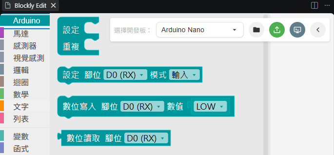

  <h2 style="margin: 0;">Step 8：可於右上角找到「編譯並上傳」按鈕將程式燒錄 (上傳) 至開發板 (同時開啟 Singular Blockly 與 Arduino IDE 可能導致序列埠 (COM) 衝突，使燒錄出現問題，必須選擇其一開啟)</h2>
  

---
transition: slide-left
layout: top-title
color: dark
routeAlias: Wokwi_Simulator
---

::title::

<h1 style="font-size: 2.5rem; font-weight: bold;">Wokwi Simulator</h1>

::content::

  <h2 style="margin: 0;">Step 0：開啟 Visual Studio Code (尚未安裝請到<Link to="VSCode_Install">Visual Studio Code 安裝</Link>)</h2>

  <h2 style="margin: 0;">Step 1：於左側找到延伸模組選項 (或 Ctrl + Shift + X)</h2>
  

  <h2 style="margin: 0;">Step 2：搜尋「Wowki Simulator」並安裝</h2>
  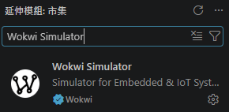

---
transition: slide-left
layout: top-title
color: dark
---

::title::

<h1 style="font-size: 2.5rem; font-weight: bold;">Wokwi Simulator</h1>

::content::

step3 於線上建立一個wokwi專案
4 下載下來(zip)
5 解壓縮後在vscode 開啟
6 開啟 .json
7 跟著提示進行連結帳號TOKEN
8 將.ino 檔名修改的與上層資料夾名稱一樣
9 使用 arduino IDE 驗證 .ino 檔
10 使用 arduino IDE 輸出編譯後的檔案
11 建立基礎.toml
(範例)
12 找到build資料夾下的.hex並複製相對位置
13 貼上指定位置
14 找到build資料夾下的.elf並複製相對位置
15 貼上指定位置
16 執行
16.5 後續要修改可以於網頁版重新排線後更改.json 和 .ino檔，重新編譯後便可執行修改後的模擬器
  <h2 style="margin: 0;">Step ：安裝後於左側找到 Wokwi Simulator 圖示</h2>
  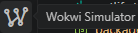

---
transition: slide-left
layout: top-title
color: dark
routeAlias: Arduino_IDE_Install
---

::title::

<h1 style="font-size: 2.5rem; font-weight: bold;">Arduino IDE 安裝</h1>

::content::

---
transition: slide-left
layout: top-title
color: dark
routeAlias: Arduino_IDE_Basic_Operation
---

::title::

<h1 style="font-size: 2.5rem; font-weight: bold;">Arduino IDE 基礎操作</h1>

::content::

---
transition: slide-left
layout: top-title
color: dark
routeAlias: Board_Wiring_Basics
---

::title::

<h1 style="font-size: 2.5rem; font-weight: bold;">開發板接線基礎概念</h1>

::content::

---
transition: slide-left
layout: top-title
color: dark
routeAlias: Programming_Basics_(Arduino_Syntax)
---

::title::

<h1 style="font-size: 2.5rem; font-weight: bold;">開發板程式基礎 (Arduino 語法)</h1>

::content::
